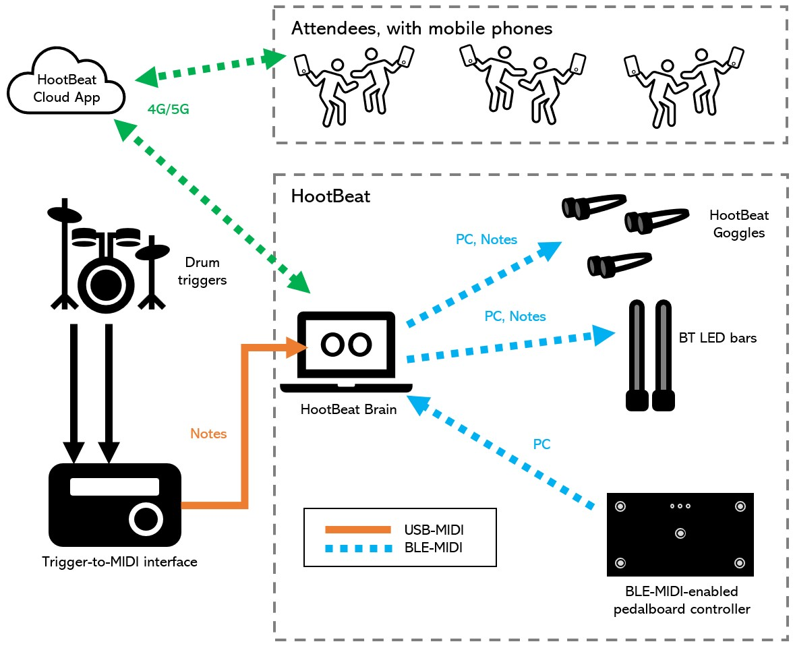
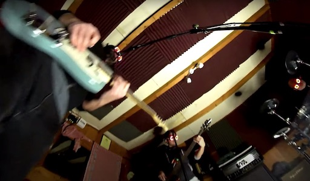

<iframe width="560" height="315" src="https://www.youtube.com/embed/7elgfIqfh_I" title="YouTube video player" frameborder="0" allow="accelerometer; autoplay; clipboard-write; encrypted-media; gyroscope; picture-in-picture" allowfullscreen></iframe>

ESP32-based BLE-MIDI controlled goggles and Raspberry Pi service to manage the system.
Great for enhancing live music performances.

## Block diagram

## Examples (images link to Youtube videos):

* [Drums demo](https://www.youtube.com/watch?v=fSSJu2f_Yg4):

* See them in action in [Spacebarman](http://www.spacebarman.com)'s music video [FOMO](https://www.youtube.com/watch?v=7elgfIqfh_I):

Directories:
- _ESP32-src_. Arduino code for goggles
- _Python-MIDI-util_. Requires python-rtmidi (https://spotlightkid.github.io/python-rtmidi/)
- _RaspberryPi-util_. Utilities to maintain BLE MIDI connections active
